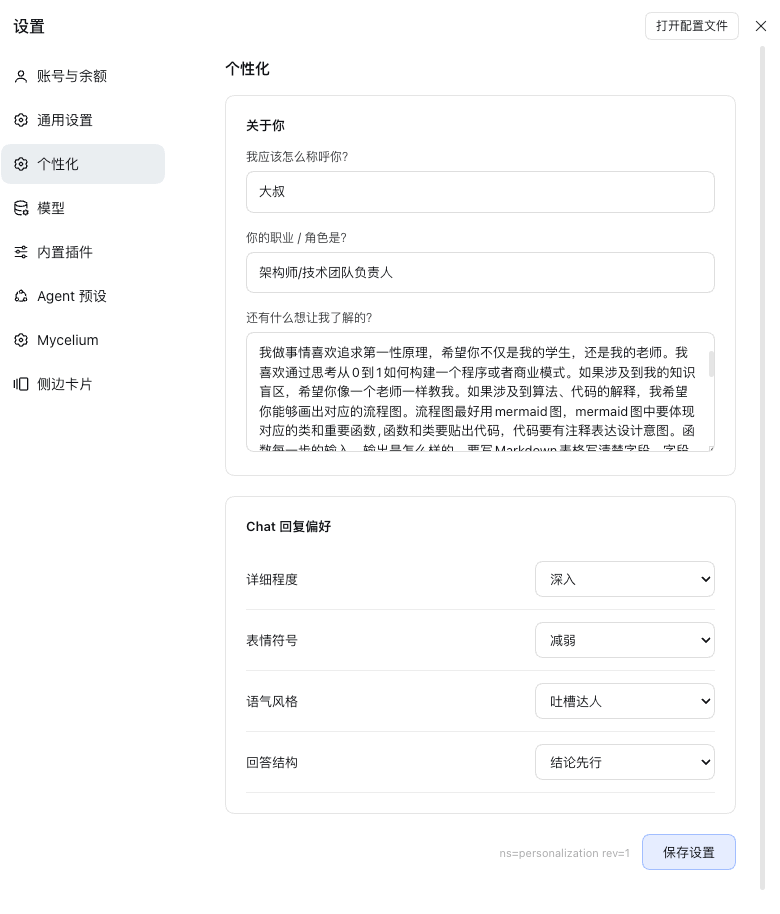

<h1 align="center">dsh-personalization-local</h1>

<p align="center">DeepSeek Harness 个性化设置插件</p>

<p align="center">
  <a href="LICENSE"></a>
  <a href="package.json"></a>
</p>

在 DSH **设置** 页新增「个性化」分区：配置称呼、职业与自我介绍、Chat 回复偏好，保存后自动注入到**每个新对话的系统提示词**中，让 AI 从第一句话起就按你的方式工作。

<!--
  截图占位：打开 DSH 设置 → 个性化，截图保存为 docs/images/settings-personalization.png
  （删除本注释后下图自动生效）
-->


## 功能

| 能力 | 说明 |
|---|---|
| 关于你 | 称呼（AI 如何叫你）、职业/角色、补充介绍 |
| Chat 回复偏好 | 详细程度 / 表情符号 / 语气风格 / 回答结构，四个下拉项 |
| 注入系统提示词 | 保存后立即生效，对**下一个新对话**起效，无需重启 |
| 持久化 | 配置写入 DSH profile 补丁，重启后保留 |

## 快速安装

需要 DeepSeek Harness `0.2.0-rc.2`（插件基于该版本 Host 的 settings / systemPrompt / client slots 接口实现）。

> **桌面版注意：** desktop profile 由应用独占管理，`dsh plugin add` 对该 profile 禁用，请走下方手工路径。

```bash
# 1. 把插件装进 desktop profile
pnpm --dir ~/.dsh/profiles/desktop add "file:/path/to/dsh-personalization-local"

# 2. 把包名追加进 bundles 清单（若尚未存在）
node -e "
const fs = require('fs'), p = process.env.HOME + '/.dsh/profiles/desktop/package.json';
const j = JSON.parse(fs.readFileSync(p, 'utf8'));
if (!j.dsh.profile.bundles.includes('dsh-personalization-local')) {
  j.dsh.profile.bundles.push('dsh-personalization-local');
  fs.writeFileSync(p, JSON.stringify(j, null, 2) + '\n');
}
console.log('bundles =', j.dsh.profile.bundles.join(', '));
"

# 3. 完全退出（Cmd+Q）并重启 DeepSeek Harness
```

## 使用

1. 打开 **设置**，左侧导航出现「**个性化**」分区；
2. 填写「关于你」与「Chat 回复偏好」，点击 **保存设置**；
3. **新开一个对话**，即可验证注入效果——例如问一句「你怎么称呼我」。

| 步骤 | 界面 |
|---|---|
| 打开设置页，点击左侧「个性化」 |  |
| 填写并保存 | 保存后按钮旁提示「已保存，对下个新对话生效」 |

## 工作原理

插件分两个半边，运行在 DSH 的两个运行时里，通过 settings 服务解耦：

| 文件 | 运行位置 | 职责 |
|---|---|---|
| `cordis.patch.yml` | Node 进程 | 向加载树 insert `personalization` 条目 |
| `lib/index.mjs` | Node 进程（宿主半） | 声明 Config schema（全部字段 `volatile()`）；监听 `loader/volatile-update` 即时重注册 systemPrompt 个性化段 |
| `lib/client.js` | 浏览器（客户端半） | 向 `settings.section` 插槽注册「个性化」表单；通过 `settings.describe/update` RPC 读写配置 |

一个关键实现细节：DSH 0.2.0 的 settings 服务**只收录含 volatile 字段的条目**——不标记 volatile 的 Config 会被 `describe()` 过滤、被 `update()` 拒绝，保存会静默失败。本插件的所有字段均标记 `volatile()`，并在宿主半监听 `loader/volatile-update` 事件保证保存后提示词即时更新。

## 与 DSH 的边界

- 插件只注册一段 systemPrompt 段落（order 取 `DEPLOYMENT_PERSONA_PREFIX` 标准位），不修改模型请求、工具 schema 或 provider 路由；
- 配置由 DSH settings 服务持久化到 profile 补丁文件，插件不自行落盘；
- 卸载插件不会影响已生成的会话。

## 许可证

[MIT](LICENSE)
